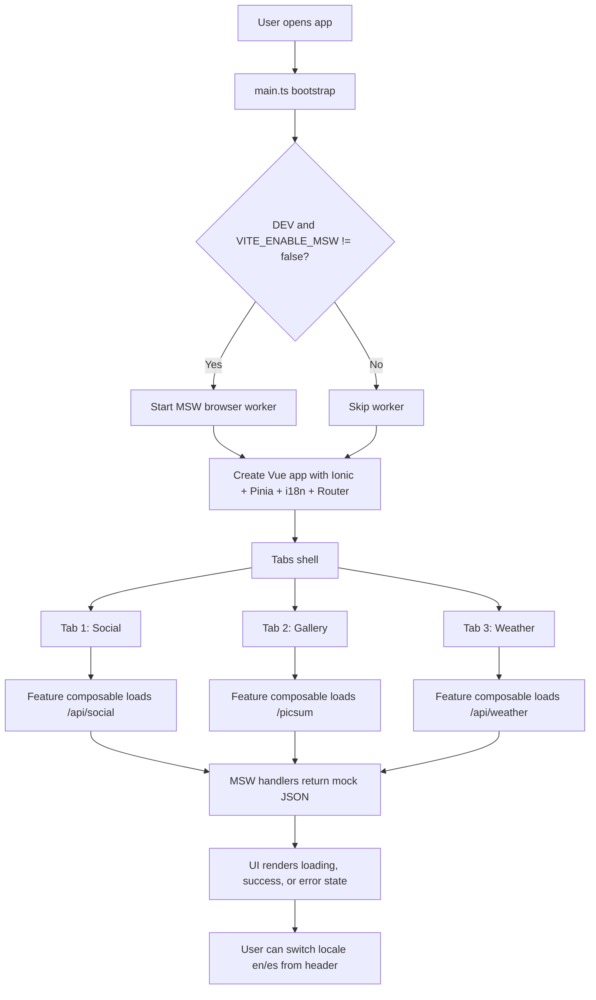

# Ionic Vue Migration PoC

Ionic Vue migration baseline following [docs/ionic-vue-migration-copilot-playbook.md](docs/ionic-vue-migration-copilot-playbook.md).

This repository demonstrates a typed Vue 3 + Ionic 8 architecture with feature modules, i18n, MSW-based API mocking, and a full quality-gate pipeline (lint, unit, render, E2E, perf).

## Tech Stack

- Vue 3 + TypeScript (strict)
- Ionic Vue 8
- Pinia (app state)
- vue-i18n (English and Spanish)
- MSW v2 (browser worker + node server for tests)
- Vitest + Testing Library (unit/render)
- Playwright (E2E)
- Lighthouse CI + web-vitals (performance)
- ESLint + Prettier + Husky + lint-staged + Commitlint

## Quick Start

### 1. Install dependencies

```bash
npm install
```

### 2. Start development server

```bash
npm run dev
```

### 3. Build production bundle

```bash
npm run build
```

### 4. Run complete test suite

```bash
npm run test:all
```

## Available Scripts

- `npm run dev`: Start local Vite dev server.
- `npm run build`: Type-check and build production bundle.
- `npm run preview`: Preview built app.
- `npm run preview:http`: Preview on `127.0.0.1:4173` for tests/perf.
- `npm run lint`: Run ESLint.
- `npm run format`: Apply Prettier.
- `npm run format:check`: Verify Prettier formatting.
- `npm run test:unit`: Run unit tests.
- `npm run test:render`: Run component/render tests.
- `npm run test:e2e`: Run Playwright tests.
- `npm run test:perf`: Build + Lighthouse CI assertions.
- `npm run test:all`: Run unit + render + E2E tests.
- `npm run msw:init`: Re-generate `public/mockServiceWorker.js` if needed.

## App Flow



## Architecture

### High-level structure

- [src/app](src/app): app-level UI building blocks (for example, shared header and icon registry).
- [src/core](src/core): cross-cutting modules (API client, typed errors, i18n, performance, state).
- [src/features](src/features): feature-first slices (`weather`, `social-media`, `image-gallery`).
- [src/mocks](src/mocks): MSW handlers and browser worker bootstrap.
- [src/views](src/views): Ionic tab pages and shell composition.
- [tests](tests): unit, render, and E2E suites.
- [docs](docs): migration playbook and parity tracking documentation.

### Feature module pattern

Each feature follows:

- `models/`: DTO or UI model types.
- `services/`: transport-focused API calls.
- `composables/`: UI state and interaction logic.
- `components/`: rendering and user interaction.

This keeps transport logic separate from view-state orchestration.

## API Mocking (MSW)

### Current setup

- Browser mocking:
  - Worker file: [public/mockServiceWorker.js](public/mockServiceWorker.js)
  - Setup: [src/mocks/browser.ts](src/mocks/browser.ts)
  - Bootstrapping: [src/main.ts](src/main.ts) via `startMockWorker()`
- Shared handlers:
  - [src/mocks/handlers.ts](src/mocks/handlers.ts)
  - Endpoints mocked: `/api/weather`, `/picsum`, `/api/social`
- Test mocking:
  - Node server: [tests/msw-server.ts](tests/msw-server.ts)
  - Lifecycle hooks: [tests/setup.ts](tests/setup.ts)

### Validation status

- Service endpoint paths match MSW handlers.
- Unit and render tests pass using the shared node server handlers.
- Browser worker is enabled only in development unless `VITE_ENABLE_MSW=false`.

### Environment toggle

- `VITE_ENABLE_MSW=false`: disables browser worker in development.
- Default behavior in dev: browser worker enabled.

## Alternatives to MSW for Vue

MSW is usually the best fit when you want one mock layer that works in browser, Vitest, and Playwright. If you need alternatives:

1. `vite-plugin-mock`:
   - Strong DX for Vite + Vue during local development.
   - Not as strong as MSW for cross-environment parity.
2. `axios-mock-adapter`:
   - Good if all API calls are Axios-based.
   - Unit-level scope; weaker for E2E and browser-level interception.
3. `json-server`:
   - Quick fake REST backend with persistent JSON files.
   - Adds separate server process and less test-level control.
4. `miragejs`:
   - Rich in-browser mock server with relational factories.
   - Heavier setup and typically browser-focused over node-test reuse.

Recommendation for this repo: keep MSW as the primary strategy, because it already aligns with both runtime and tests and centralizes API contracts.

## Internationalization

- i18n files:
  - [src/assets/i18n/en.json](src/assets/i18n/en.json)
  - [src/assets/i18n/es.json](src/assets/i18n/es.json)
- Setup:
  - [src/core/i18n/index.ts](src/core/i18n/index.ts)
- Locale switch UI:
  - [src/app/AppHeader.vue](src/app/AppHeader.vue)

## Performance

- Web vitals reporting in production:
  - [src/core/performance/web-vitals.ts](src/core/performance/web-vitals.ts)
- Lighthouse CI config:
  - [lighthouserc.cjs](lighthouserc.cjs)
- Bundle strategy:
  - Manual chunking in [vite.config.ts](vite.config.ts)

## Testing Strategy

- Unit tests: services/utilities.
- Render tests: component behavior, i18n, accessibility states.
- E2E tests: user navigation and language switching.
- Perf tests: Lighthouse assertions and smoke checks.

Relevant files:

- [tests/unit](tests/unit)
- [tests/render](tests/render)
- [tests/e2e-playwright](tests/e2e-playwright)

## Quality Gates

Run these before merging:

```bash
npm run lint
npm run format:check
npm run test:all
npm run test:perf
```

## Security and Dependency Audit

Current status after running install, audit remediation, and major toolchain upgrades:

- Production dependencies: 0 vulnerabilities (`npm audit --omit=dev`).
- Development dependencies: 4 vulnerabilities remain (`4 low`, `0 moderate`).

Why dev vulnerabilities remain:

- They are in the Lighthouse CI dependency chain (`@lhci/cli -> inquirer -> external-editor -> tmp`).
- `npm audit` suggests a semver-major downgrade path (`@lhci/cli@0.1.0`) that is not an appropriate automatic remediation for this project.

Recommended follow-up path:

1. Keep current upgraded Vite/Vitest/jsdom stack (already applied and validated).
2. Track upstream `@lhci/cli` advisory resolution and update when a non-breaking fixed release is available.
3. Optionally evaluate replacing `@lhci/cli` with direct Lighthouse + custom assertions if security policy requires zero dev vulnerabilities.
4. Continue running full gates: lint, format, unit, render, e2e, perf.

## Git Hooks and Commit Rules

- Pre-commit hook: `lint-staged` (ESLint + Prettier).
- Commit message hook: commitlint conventional commits with scoped rules.
- Config files:
  - [commitlint.config.cjs](commitlint.config.cjs)
  - [eslint.config.mjs](eslint.config.mjs)
  - [.husky/pre-commit](.husky/pre-commit)
  - [.husky/commit-msg](.husky/commit-msg)

## Commit Rules

- Use conventional commit messages: `<type>(<scope>): <subject>`
  - Example: `feat(social-media): add like button accessibility label`
- Allowed types: `feat`, `fix`, `docs`, `style`, `refactor`, `test`, `chore`, `perf`, `ci`
- Scope should match feature, domain, or tooling area (e.g., `weather`, `gallery`, `core`, `build`)
- Subject should be concise and imperative
- All commits are checked by commitlint and must pass the pre-commit hook
- See [commitlint.config.cjs](commitlint.config.cjs) for allowed types and scopes
- See [.husky/commit-msg](.husky/commit-msg) for commit message enforcement

---

_Last update: March 19, 2026_
